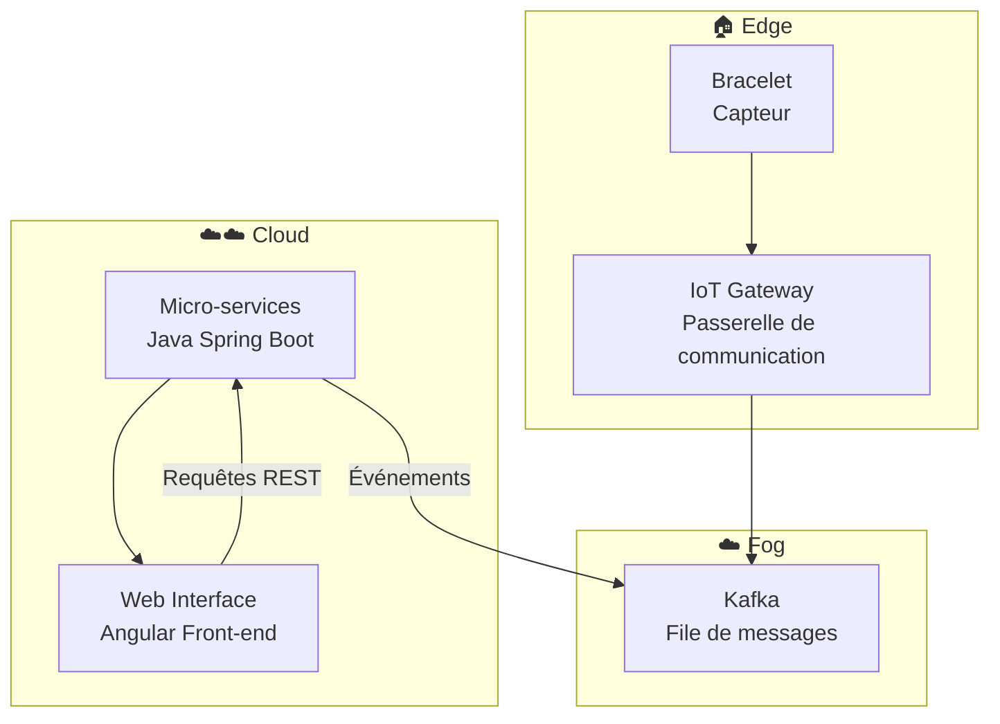
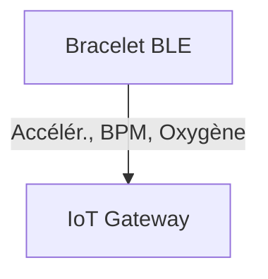
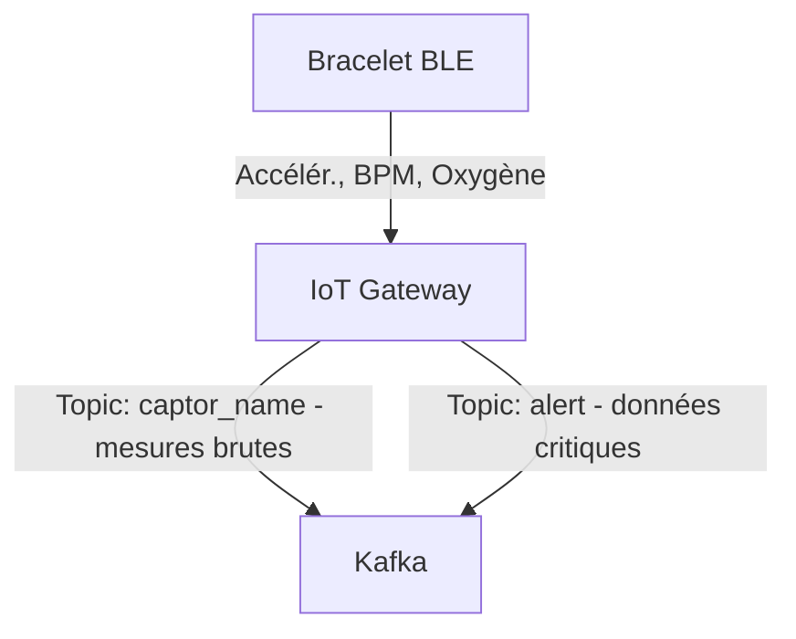

# Architecture

⚠️ Note : Tout ce qui suit ne fait pas nécessairement partie de la version actuelle du dépôt (PoC). Il s’agit d’objectifs et de bonnes pratiques à intégrer dans le futur pour transformer le projet en une solution de qualité production et médicale.

## 1) Vue d’ensemble globale (contexte et composants)

Le projet est organisé en plusieurs sous-projets :

* `web-interface` : interface web front-end (Angular). 

* `micro-services` : services back-end (Java Spring).
  
* `kafka` : composants/connexions liés à Kafka (gestion des topics, producteurs/consommateurs).
  
* `iot_gateway` : passerelle pour le bracelet connecté.
  
* `bracelet` : code embarqué (firmware / prototype matériel) pour collecte de données, communiquant par BLE.

Chaque dossier représente un élément du flow suivant :  

---

## 2) Rôles et responsabilités des composants

###  `web-interface` (Front-end Angular)
- **Rôle principal :** fournir une interface utilisateur claire pour la supervision, la configuration et le suivi des données collectées.  
- **Responsabilités :**
  - Consommer les API REST exposées par les micro-services.
  - Afficher les mesures reçues via un dashboard.
  - Permettre l’authentification.
  - Permettre le paramétrage des bracelets (attribution d'un bracelet à un patient).
  - Completion de formulaire pour un patient
- **Technologies :** Angular 20, TypeScript, HTML, CSS.

---

### `micro-services` (Back-end Java Spring Boot)
- **Rôle principal :** gérer la logique métier, le stockage des données et les interactions entre la queue kafka et l’interface web.  
- **Responsabilités :**
  - Fournir les API REST consommées par le front-end.
  - Traiter les messages issus de Kafka.
  - Gérer la persistance des données dans la base de données.
  - Implémenter les mécanismes d’alerte ou de détection d’anomalies.
  - Exposer des endpoints de monitoring et de santé.
- **Technologies :** Java 25, Spring Boot, JPA/Hibernate, PostgreSQL.

---

### `kafka` (Bus de messages)
- **Rôle principal :** assurer la communication asynchrone entre la passerelle IoT et les micro-services.  
- **Responsabilités :**
  - Gérer la file d’attente des messages (topics) pour la télémétrie et les alertes.
  - Permettre la mise à l’échelle horizontale (plusieurs producteurs/consommateurs).
- **Fonctionnement :**
  - `iot_gateway` agit comme **producteur**.
  - Les `micro-services` agissent comme **consommateurs**.
- **Technologies :** Apache Kafka, Zookeeper

---

### `iot_gateway` (Passerelle IoT)
- **Rôle principal :** faire le lien entre le monde physique (bracelet BLE) et le fog.  
- **Responsabilités :**
  - Établir la communication BLE avec le bracelet.
  - Gérer la connectivité réseau (Wi-Fi, Ethernet, 4G) pour publier vers Kafka.
  - Implémenter la sécurité (authentification des devices, chiffrement des échanges).
  - Servir de point de contrôle pour envoyer des commandes au bracelet.
- **Technologies :** Node.js, Kafka Producer API.

---

### `bracelet` (Firmware / Périphérique BLE)
- **Rôle principal :** collecter les données physiologiques et environnementales, puis les transmettre à la passerelle.  
- **Responsabilités :**
  - Mesurer les données (ex : fréquence cardiaque, oxygène et accéléromètre).
  - Communiquer via **Bluetooth Low Energy (BLE)**.
  - Gérer la consommation d’énergie et la fiabilité de la connexion.
  - Réceptionner éventuellement des commandes venant de la passerelle (mise à jour, calibration).

---

**Résumé du flux global :**
1. Le **bracelet** collecte les données et les envoie à la **IoT Gateway** via BLE.  
2. L' **IOT Gateway** publie ces données dans **Kafka** sous forme de messages.  
3. Les **micro-services** consomment ces messages, les traitent et les stockent.  
4. La **web-interface** récupère les informations et les affiche à l’utilisateur final.

---

## 3) Composants : flux et mécanismes

### 3.1 Bracelet

**Rôle :** capteur BLE embarqué pour collecte de données physiologiques.

**Métriques collectées :**
- **Accéléromètre** : activité (toutes les 1s).  
- **BPM (heartRate)** : fréquence cardiaque (toutes les 5s).  
- **Oxygène (bloodOxygen)** : saturation en oxygène SpO₂ (toutes les 10s).  

**Mécanismes :**

- **Workflow :**
  - Mesure des métriques selon des intervalles configurables :  
    - **Justification :** Accéléromètre exige une fréquence plus élevée pour capturer les mouvements précis, alors que BPM et SpO₂ varient plus lentement, permettant des intervalles plus longs pour réduire le trafic réseau et la consommation d’énergie.  
  - Transmission périodique vers l’IoT Gateway via WebSocket (PoC uniquement) ou BLE.  
    - **Justification :** BLE est efficace pour les communications locales à faible consommation. WebSocket permet un protocole fiable pour tests ou simulation sans matériel BLE.  
  - Messages envoyés individuellement ou en **batch** en cas de perte de connectivité avec kafka.  
  - ACK ou confirmation de réception pour garantir la fiabilité.  
    - **Justification :** Assure que les données critiques physiologiques ne sont pas perdues et permet un suivi précis.  

- **Sécurité :**
  - Appairage BLE sécurisé et chiffrement AES-CCM.  
    - **Justification :** Protection contre interception ou injection de données sensibles.  
  - Signature et checksum pour garantir l’intégrité des données.  
    - **Justification :** Vérifie que les données ne sont pas corrompues pendant la transmission.    

- **Fiabilité :**
  - Retry automatique pour messages non envoyés ou non accusés.  
    - **Justification :** Permet de gérer les interruptions réseau temporaires et assure la complétude des données.   
  - Possibilité de **batching conditionnel** pour optimiser le trafic réseau.  
    - **Justification :** Limite le nombre de messages envoyés pour les métriques lentes (BPM, SpO₂), économisant énergie et bande passante.  

- **Déploiement :**
  - Stockage tampon minimal pour messages non transmis, libéré dès réception confirmée par la Gateway.  
    - **Justification :** Garantit fiabilité tout en limitant l’utilisation mémoire sur le bracelet.  

- **Monitoring :**
  - Logs internes limités pour économie de mémoire, exportables via Gateway pour supervision.  
    - **Justification :** Permet de suivre la santé du dispositif et de diagnostiquer les problèmes sans saturer le bracelet.  
  
**Schéma :**

### 3.2 IoT Gateway

**Rôle :** passerelle entre les bracelets publication des données sur Kafka.

**Mécanismes :**

**Mécanismes :**

- **Workflow :**
  - Reçoit les données des bracelets via **BLE**.  
  - Conversion et normalisation des mesures en **JSON**.  
  - Publication sur les topics Kafka :  
    - `captor_name` : données brutes issues des capteurs (Accéléromètre, BPM, Oxygène).  
    - `alert` : alertes médicales détectées en local (ex. rythme cardiaque anormal, oxygénation faible, chute).  
  - Envoi d’un **ACK** vers le bracelet après réception et validation des données.  
  - **Justification :** la séparation entre `captor_name` et `alert` permet un routage prioritaire des urgences sans surcharger le flux principal de télémétrie.

- **Sécurité :**
  - Connexion BLE sécurisée avec chiffrement **AES-CCM**.  
  - Connexion à Kafka via **SASL_SSL** pour authentification et chiffrement des échanges.  
  - Validation du schéma JSON et contrôle d’intégrité avant envoi.  
  - **Justification :** ces mécanismes garantissent que seules des données fiables et authentifiées sont propagées vers le Cloud.

- **Fiabilité :**
  - Buffer local (en RAM ou fichier) pour stocker temporairement les mesures en cas de perte de connectivité Kafka.  
  - Retry exponentiel pour les envois échoués.  
  - Reconnexion BLE automatique.  
  - **Justification :** permet une continuité du flux de données même en cas d’incident réseau ou matériel.

- **Déploiement :**
  - Conteneur Docker léger (ARM/x86 compatible).  
  - Configuration via variables d’environnement (Kafka brokers, topics, seuils d’alerte, fréquence de polling).  
  - Healthchecks actifs pour supervision par orchestrateur (Docker Compose).  
  - **Justification :** assure un déploiement homogène sur différentes passerelles physiques tout en simplifiant la maintenance.

- **Monitoring :**
  - Export métriques vers Prometheus : taux de messages traités, taux d’erreurs, latence BLE, backlog Kafka.  
  - Logs structurés au format JSON.  
  - Alertes techniques si déconnexion prolongée ou fréquence de publication anormale.  
  - **Justification :** visibilité complète du pipeline IoT et détection proactive des pannes.

**Schéma :**

