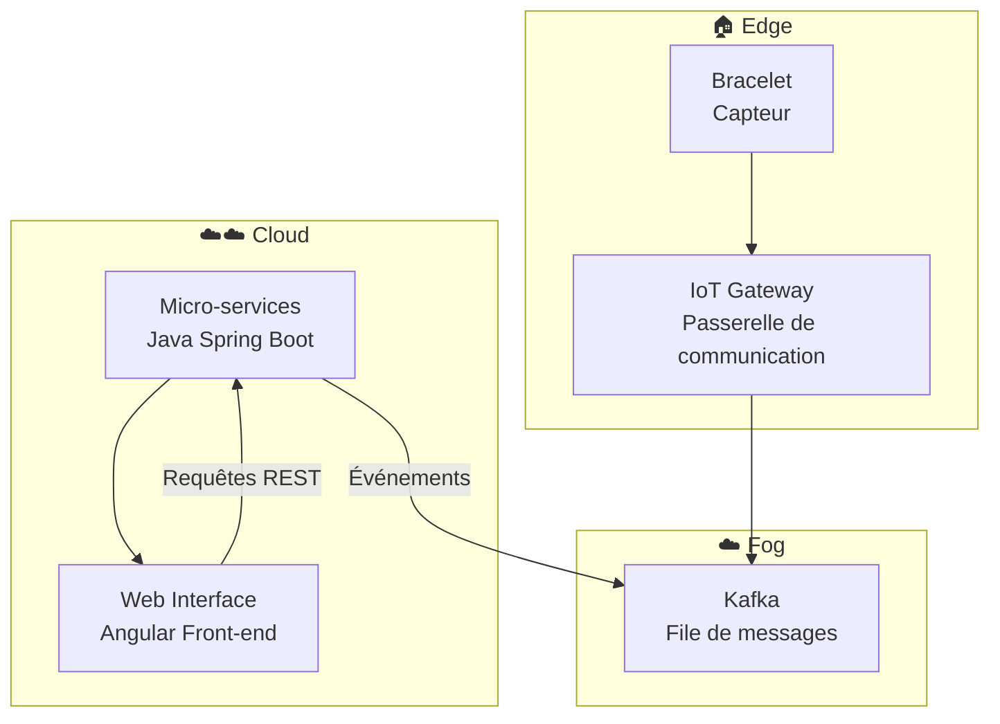
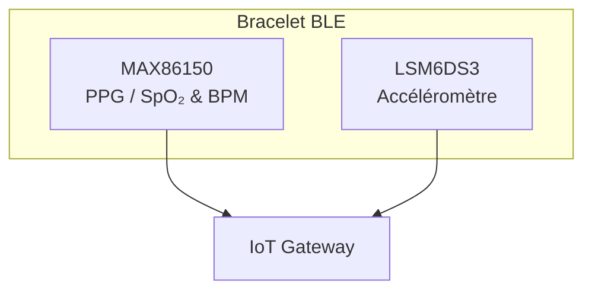
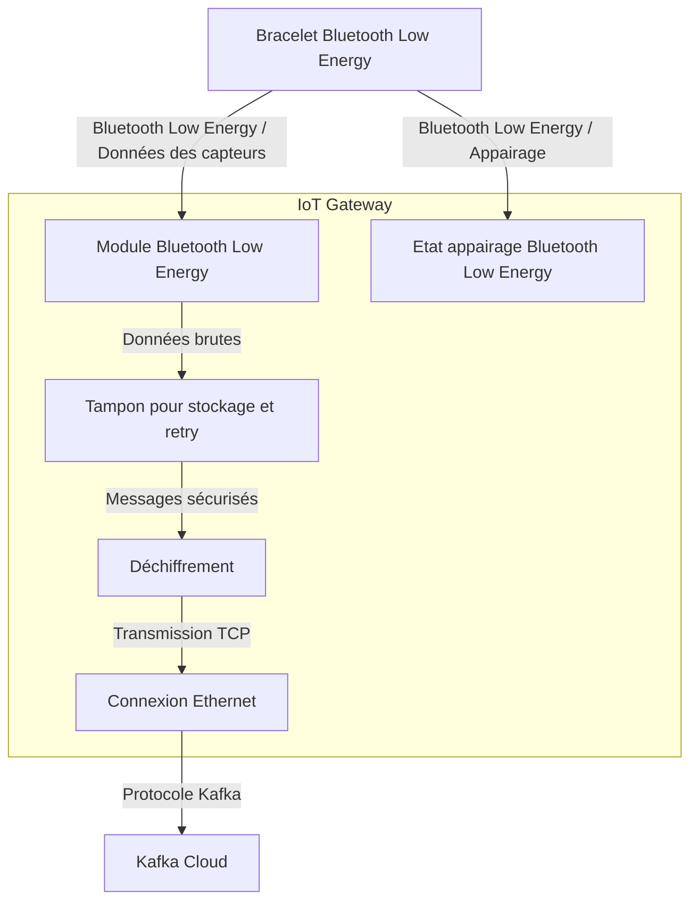
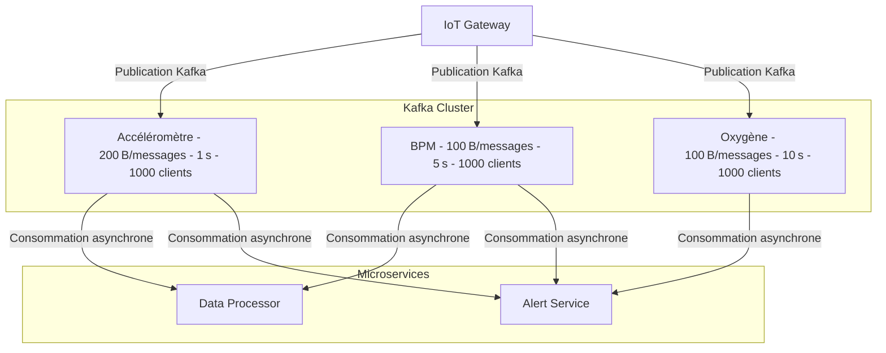
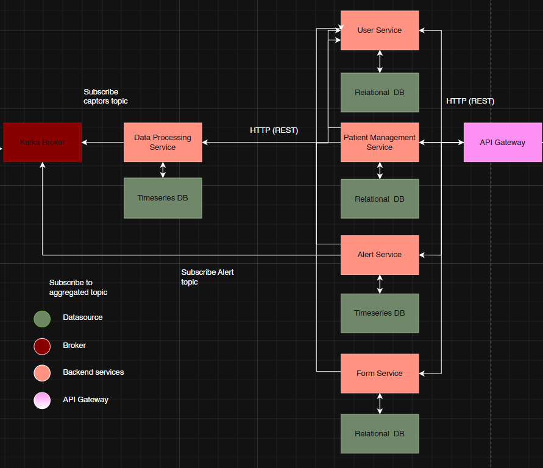
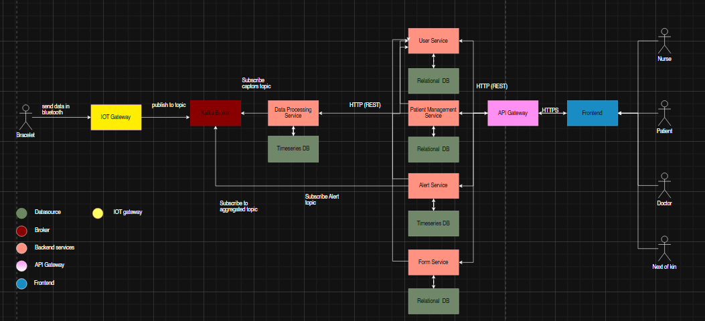

# Architecture

⚠️ Note : Tout ce qui suit ne fait pas nécessairement partie de la version actuelle du dépôt (PoC). Il s’agit d’objectifs et de bonnes pratiques à intégrer dans le futur pour transformer le projet en une solution de qualité production et médicale.

## 1) Vue d’ensemble globale (contexte et composants)

Le projet est organisé en plusieurs sous-projets :

* `web-interface` : interface web front-end (Angular). 

* `micro-services` : services back-end (Java Spring).
  
* `kafka` : composants/connexions liés à Kafka (gestion des topics, producteurs/consommateurs).
  
* `iot_gateway` : passerelle pour le bracelet connecté.
  
* `bracelet` : code embarqué (firmware / prototype matériel) pour collecte de données, communiquant par BLE.

Chaque dossier représente un élément du flow suivant :  

---

## 2) Rôles et responsabilités des composants

###  `web-interface` (Front-end Angular)
- **Rôle principal :** fournir une interface utilisateur claire pour la supervision, la configuration et le suivi des données collectées.  
- **Responsabilités :**
  - Consommer les API REST exposées par les micro-services.
  - Afficher les mesures reçues via un dashboard.
  - Permettre l’authentification.
  - Permettre le paramétrage des bracelets (attribution d'un bracelet à un patient).
  - Completion de formulaire pour un patient
- **Technologies :** Angular 20, TypeScript, HTML, CSS.

---

### `micro-services` (Back-end Java Spring Boot)
- **Rôle principal :** gérer la logique métier, le stockage des données et les interactions entre la queue kafka et l’interface web.  
- **Responsabilités :**
  - Fournir les API REST consommées par le front-end.
  - Traiter les messages issus de Kafka.
  - Gérer la persistance des données dans la base de données.
  - Implémenter les mécanismes d’alerte ou de détection d’anomalies.
  - Exposer des endpoints de monitoring et de santé.
- **Technologies :** Java 25, Spring Boot, JPA/Hibernate, PostgreSQL.

---

### `kafka` (Bus de messages)
- **Rôle principal :** assurer la communication asynchrone entre la passerelle IoT et les micro-services.  
- **Responsabilités :**
  - Gérer la file d’attente des messages (topics) pour la télémétrie et les alertes.
  - Permettre la mise à l’échelle horizontale (plusieurs producteurs/consommateurs).
- **Fonctionnement :**
  - `iot_gateway` agit comme **producteur**.
  - Les `micro-services` agissent comme **consommateurs**.
- **Technologies :** Apache Kafka, Zookeeper

---

### `iot_gateway` (Passerelle IoT)
- **Rôle principal :** faire le lien entre le monde physique (bracelet BLE) et le fog.  
- **Responsabilités :**
  - Établir la communication BLE avec le bracelet.
  - Gérer la connectivité réseau (Wi-Fi, Ethernet, 4G) pour publier vers Kafka.
  - Implémenter la sécurité (authentification des devices, chiffrement des échanges).
  - Servir de point de contrôle pour envoyer des commandes au bracelet.
- **Technologies :** Node.js, Kafka Producer API.

---

### `bracelet` (Firmware / Périphérique BLE)
- **Rôle principal :** collecter les données physiologiques et environnementales, puis les transmettre à la passerelle.  
- **Responsabilités :**
  - Mesurer les données (ex : fréquence cardiaque, oxygène et accéléromètre).
  - Communiquer via **Bluetooth Low Energy (BLE)**.
  - Gérer la consommation d’énergie et la fiabilité de la connexion.
  - Réceptionner éventuellement des commandes venant de la passerelle (mise à jour, calibration).

---

**Résumé du flux global :**
1. Le **bracelet** collecte les données et les envoie à la **IoT Gateway** via BLE.  
2. L' **IOT Gateway** publie ces données dans **Kafka** sous forme de messages.  
3. Les **micro-services** consomment ces messages, les traitent et les stockent.  
4. La **web-interface** récupère les informations et les affiche à l’utilisateur final.

---

## 3) Composants : flux et mécanismes

### 3.1 Bracelet

**Rôle :** capteur BLE embarqué pour collecte de données physiologiques.

**Métriques collectées :**
- **Accéléromètre** : activité (toutes les 1s).  
- **BPM (heartRate)** : fréquence cardiaque (toutes les 5s).  
- **Oxygène (bloodOxygen)** : saturation en oxygène SpO₂ (toutes les 10s).  

**Capteurs embarqués :**
- **MAX86150** : capteur optique PPG (Photopléthysmographie) utilisé pour la mesure de la fréquence cardiaque (BPM) et de la saturation en oxygène (SpO₂).  
- **LSM6DS3** : accéléromètre triaxial permettant de détecter l'activité physique et les mouvements du porteur avec une haute fréquence d'échantillonnage.  

**Mécanismes :**

- **Workflow :**
  - Mesure des métriques selon des intervalles configurables :  
    - **Justification :** Accéléromètre exige une fréquence plus élevée pour capturer les mouvements précis, alors que BPM et SpO₂ varient plus lentement, permettant des intervalles plus longs pour réduire le trafic réseau et la consommation d’énergie.  
  - Transmission périodique vers l’IoT Gateway via WebSocket (PoC uniquement) ou BLE.  
    - **Justification :** BLE est efficace pour les communications locales à faible consommation. WebSocket permet un protocole fiable pour tests ou simulation sans matériel BLE.  
  - Messages envoyés individuellement ou en **batch** en cas de perte de connectivité avec kafka.  
  - ACK ou confirmation de réception pour garantir la fiabilité.  
    - **Justification :** Assure que les données critiques physiologiques ne sont pas perdues et permet un suivi précis.  
  
--- 

- **Appairage et indicateur visuel :**
  - L’appairage BLE se fait selon un protocole sécurisé impliquant un processus d’authentification mutuelle entre le bracelet et la gateway.  
  - **Voyant LED de pairing :** Le bracelet est équipé d’un voyant lumineux indiquant l’état d’appairage :  
    - Clignotement rapide : mode appairage actif, attendant qu’un utilisateur clique pour accepter la connexion.  
    - Vert fixe : appairage réussi et connexion établie.  
    - Rouge fixe ou absence de lumière : appairage échoué ou non connecté.  
  - L’utilisateur doit valider l’appairage via une action manuelle (clic sur un bouton physique) pour éviter un appairage automatique non souhaité, renforçant la sécurité et le contrôle utilisateur.  

---

- **Sécurité :**
  - Appairage BLE sécurisé et chiffrement AES-CCM.  
    - **Justification :** Protection contre interception ou injection de données sensibles.  
  - Signature et checksum pour garantir l’intégrité des données.  
    - **Justification :** Vérifie que les données ne sont pas corrompues pendant la transmission.    

---

- **Fiabilité :**
  - Retry automatique pour messages non envoyés ou non accusés.  
    - **Justification :** Permet de gérer les interruptions réseau temporaires et assure la complétude des données.   
  - Possibilité de **batching conditionnel** pour optimiser le trafic réseau.  
    - **Justification :** Limite le nombre de messages envoyés pour les métriques lentes (BPM, SpO₂), économisant énergie et bande passante.  

---

- **Déploiement :**
  - Stockage tampon minimal pour messages non transmis, libéré dès réception confirmée par la Gateway.  
    - **Justification :** Garantit fiabilité tout en limitant l’utilisation mémoire sur le bracelet.  

---

- **Monitoring :**
  - Logs internes limités pour économie de mémoire, exportables via Gateway pour supervision.  
    - **Justification :** Permet de suivre la santé du dispositif et de diagnostiquer les problèmes sans saturer le bracelet.  

---

**Schéma :**

### 3.2 IoT Gateway

**Rôle :** passerelle centralisant les données des bracelets Bluetooth Low Energy, assurant leur réception, sécurisation, normalisation et publication sur Kafka via une connexion réseau filaire.

---

### Mécanismes

* **Flux de travail :**

  * Reçoit les données des bracelets via **Bluetooth Low Energy** (données des capteurs et signaux d’appairage).

    * **Justification :** BLE est peu consommateur d’énergie et permet une communication locale fiable entre le bracelet et la gateway.

  * Gestion de l’état d’appairage Bluetooth Low Energy :

    * `Etat appairage Bluetooth Low Energy` correspond au statut de l’appairage (en attente, appairé, erreur)
    * Communication avec le bracelet pour contrôle du bouton de mise en appairage et retour LED.

      * **Justification :** Permet de suivre le statut de chaque bracelet, d’initier l’appairage de manière sécurisée et de fournir un retour utilisateur visuel, essentiel pour la mise en service.

  * Module Bluetooth Low Energy (`Module Bluetooth Low Energy`) reçoit les mesures brutes des capteurs et transmet les données vers le tampon.

    * **Justification :** Centralise la réception et prépare les données pour traitement, en séparant le flux de contrôle (appairage) du flux de données.

  * Tampon local (`Buffer`) pour stockage temporaire et gestion des tentatives de renvoi ou regroupement des messages en cas de perte de connectivité.

    * **Justification :** Garantit la continuité des flux de données même en cas de problème réseau ou Kafka temporairement indisponible.

  * Déchiffrement et vérification d’intégrité (`Déchiffrement et vérification du code de contrôle`) pour garantir confidentialité et exactitude des données.

    * **Justification :** Assure que les données physiologiques ne sont pas interceptées ou corrompues avant d’être envoyées vers le cloud.

  * Transmission via réseau (`Ethernet`) vers Kafka Cloud.

    * **Justification :** Ethernet fournit une connexion stable et performante, essentielle pour la fiabilité des flux de données critiques.

  * Publication sur les sujets Kafka (`captor_name`) avec les données brutes des capteurs.

    * **Justification :** Permet l’organisation et la consommation des données dans le cloud de manière structurée et évolutive.

  * Accusé de réception envoyé au bracelet après validation et sécurisation des messages.

    * **Justification :** Confirme au bracelet que les données ont été reçues et traitées, évitant toute perte d’information.

---

* **Sécurité :**

  * Chiffrement Bluetooth Low Energy avec **AES-CCM** entre bracelet et passerelle.

    * **Justification :** Garantit la confidentialité des données sensibles (BPM, SpO₂, accéléromètre).

  * Authentification et chiffrement via **TLS avec SASL_SSL** pour la communication vers Kafka.

    * **Justification :** Empêche les accès non autorisés au cloud et assure l’intégrité des messages pendant le transport.

  * Contrôle d’intégrité via code de contrôle et validation des schémas JSON.

    * **Justification :** Assure que les données reçues sont conformes au format attendu et n’ont pas été corrompues.

  * Séparation des flux Bluetooth Low Energy et réseau pour limiter les risques d’intrusion.

    * **Justification :** Contient les risques de compromission et protège la gateway et le cloud contre les attaques externes.

---

* **Fiabilité :**

  * Tampon local pour assurer la continuité des données même en cas d’indisponibilité réseau.

    * **Justification :** Évite la perte de données en cas d’incident réseau ou serveur temporairement indisponible.

  * Tentatives automatiques de renvoi avec temporisation progressive et journalisation des échecs.

    * **Justification :** Permet de gérer les interruptions temporaires et de diagnostiquer facilement les incidents.

  * Reconnexion automatique Bluetooth Low Energy avec les bracelets en cas de déconnexion.

    * **Justification :** Maintient le lien avec le bracelet sans intervention manuelle, assurant la continuité des mesures.

  * Surveillance continue des interfaces réseau Ethernet et Wi-Fi pour basculement automatique si nécessaire.

    * **Justification :** Garantit la disponibilité et la fiabilité des flux de données en choisissant le meilleur canal réseau disponible.

---

* **Déploiement :**

  * Conteneur Docker léger, compatible avec les architectures ARM et x86.

    * **Justification :** Facilite l’installation et la portabilité sur différents types de passerelles physiques.

  * Paramétrable via variables d’environnement : adresses et ports des brokers Kafka, sujets Kafka, paramètres Bluetooth Low Energy.

    * **Justification :** Permet d’adapter rapidement la configuration à différents environnements ou besoins opérationnels.

---

* **Supervision :**

  * Export des métriques vers Prometheus incluant : taux de messages reçus et traités, taux d’erreurs, latence des connexions Bluetooth Low Energy et réseau, taille du tampon.

    * **Justification :** Permet un suivi précis des performances et détecte rapidement les anomalies.

  * Journalisation structurée au format JSON pour corrélation avec les métriques et diagnostic.

    * **Justification :** Facilite l’analyse et la corrélation des événements pour anticiper ou résoudre rapidement les problèmes.

---

**Schéma :**

### 3.3 Kafka

**Rôle :** middleware assurant la transmission fiable, asynchrone et distribuée des données entre la couche IoT (Gateway) et les micro-services du Cloud, capable de supporter un volume important de clients.

---

**Mécanismes :**

* **Workflow :**

  * Reçoit les publications de la Gateway sur trois topics principaux :

    * `accelerometer` → données brutes Accéléromètre (200 B/messages, 1 s)
    * `heartRate` → données BPM (100 B/messages, 5 s)
    * `bloodOxygen` → données SpO₂ (100 B/messages, 10 s)
  * Chaque topic est partitionné pour permettre le parallélisme et une ingestion rapide.
  * Les micro-services consommateurs (`data-processor`, `alert-service`) s’abonnent aux topics correspondants.
  * **Justification :** découple la collecte IoT du traitement applicatif et permet une ingestion fluide pour 1000 clients, avec possibilité d’augmenter la capacité en ajoutant des partitions ou brokers.

---

* **Sécurité :**

  * Communication sécurisée via **SASL_SSL** (authentification + chiffrement TLS).
  * Contrôle d’accès par **ACL** sur les topics : seules les passerelles autorisées peuvent publier, et seuls les micro-services validés peuvent consommer.
  * **Justification :** prévient les accès non autorisés et garantit l’intégrité des messages.

---

* **Fiabilité :**

  * Réplication des partitions.
  * Acknowledgements (`acks=all`) pour garantir la persistance des messages.
  * Stockage persistant pour tous les messages publiés.
  * **Justification :** aucun message n’est perdu même en cas de panne d’un broker ou d’une Gateway.

---

* **Déploiement :**

  * Cluster Kafka orchestré (Docker Compose ou Kubernetes).
  * Brokers distribués, avec possibilité d’ajouter des brokers si le nombre de clients augmente.
  * Configuration de la rétention (1 jour pour l’Accéléromètre, BPM, SpO₂) et limitation du débit par topic.
  * **Justification :** permet une montée en charge linéaire et un déploiement multi-environnements.

---

* **Monitoring :**

  * Intégration Prometheus : latence de production et consommation, taille des partitions, taux d’erreurs, backlog de messages non consommés.
  * Alertes sur consommation lente ou saturation de partition.
  * **Justification :** garantit la stabilité du pipeline temps réel et une réactivité rapide aux anomalies.

---

* **Scalabilité :**

  * Partitionnement par capteur pour paralléliser le traitement des données.
  * Possibilité d’ajouter des brokers et partitions si le nombre de clients dépasse 1000, pour maintenir un débit fluide.
  * **Justification :** Kafka supporte une croissance continue, jusqu’à plusieurs dizaines de milliers de clients simultanés, sans goulot d’étranglement.

---

**Schéma :**

## Microservices

**Rôle global :**
Ensemble de services **Spring Boot** indépendants et conteneurisés, exposant des **API REST sécurisées (TLS)** pour :

* La gestion des utilisateurs (`User Service`).
* La collecte et l’analyse des données physiologiques (`Data Processing Service`).
* La gestion et soumission des formulaires (`Form Service`).
* L’agrégation des informations patient (`Patient Management Service`).
* Système d’alerte envoyant emails et notifications web (`Alert Service`).
* Authentification et redirection vers les services (`Gateway`).

---

### **Éléments globaux de l’infrastructure :**

* **Cluster Kubernetes :**

  * Orchestration des conteneurs pour scalabilité et haute disponibilité.
  * Rollouts progressifs et mises à jour sans interruption (zero-downtime deployment).
  * Load balancing interne entre microservices.

* **API Gateway (microservice) :**

  * Point d’entrée unique pour tous les clients.
  * Authentification centralisée via JWT.
  * Routage vers les services appropriés (`User Service`, `Form Service`, etc.).

* **Kafka :**

  * Communication asynchrone pour les alertes et les données critiques.
  * Décorrélation entre producteurs (Gateway / Data Processing) et consommateurs (Alert Service).
  * Support de plusieurs consommateurs pour le scaling horizontal.

* **Bases de données dédiées :**

  * Isolation par service (PostgreSQL standard pour Users et Forms, TimescaleDB pour Data Processing).
  * Sauvegardes et restaurations indépendantes.

* **Monitoring et observabilité :**

  * **Prometheus + Grafana** pour mesurer latence, taux d’erreurs, consommation Kafka.
  * Logs centralisés pour debugging et audit.
  * Liveness & readiness probes pour Kubernetes afin de détecter et redémarrer automatiquement les services en erreur.

* **Sécurité :**

  * TLS pour toutes les communications REST inter-services.
  * Gestion des secrets via Vault / Kubernetes Secrets.
  * Accès base de données restreint par service et rôle.

---

### **Justifications :**

* **Conteneurs + Kubernetes** : scalabilité, résilience, déploiement sûr et rapide.
* **Gateway centralisée** : simplifie l’authentification et le routage, réduit le couplage direct entre services.
* **Kafka** : tolérance aux pannes et scalabilité.
* **Bases dédiées** : isolation des données, flexibilité, performance, et sécurité.
* **Monitoring et observabilité** : indispensable pour détecter les anomalies, respecter les SLA et garantir la sécurité des données patients.

## 🔹 Gateway Microservice

**Rôle :**

* Point d’entrée unique pour toutes les requêtes externes (Web Interface, clients mobiles).
* Authentification centralisée (JWT + TLS) et routage vers les microservices appropriés (`User Service`, `Form Service`).
* Gestion des flux entrants vers le `Data Processing Service` pour publication Kafka si nécessaire.

**Mécanismes :**

* REST sécurisé via TLS pour toutes les communications.
* Routage interne vers les services backend.
* Monitoring latence et taux d’erreurs via Prometheus.
* Scalabilité horizontale via Kubernetes.
* Rate limiting
* Circuit breaker
* Timeouts & retries
* Health checks

**Base de données :**

* Aucun stockage dédié ; tout est relayé vers les microservices backend.

**Justification :**

* Centralisation de l’authentification et du routage pour réduire le couplage et améliorer la sécurité globale.

---

## 🔹 User Service + PostgreSQL

**Rôle :**

* Gestion des utilisateurs : création, modification, suppression, consultation.
* Gestion des permissions et historiques de connexion.

**Mécanismes :**

* REST via Gateway pour toutes les requêtes utilisateurs.
* Stockage dans PostgreSQL relationnel.
* Sauvegarde et réplication pour résilience.

**Justification :**

* Isolation des données sensibles et intégrité relationnelle pour la conformité et sécurité.
* Scalabilité indépendante possible via Kubernetes.

---

## 🔹 Form Service + PostgreSQL + JSONB

**Rôle :**

* Gestion des formulaires flexibles soumis par utilisateurs/patients.
* Support de données semi-structurées pour différents types de formulaires.

**Mécanismes :**

* REST via Gateway.
* Stockage dans PostgreSQL avec **JSONB** pour flexibilité.
* Sauvegarde indépendante pour éviter impact sur d’autres services.

**Justification :**

* Flexibilité maximale des formulaires.
* Isolation et scalabilité indépendantes pour une meilleure performance globale.

---

## 🔹 Data Processing Service + TimescaleDB (DPDB)

**Rôle :**

* Collecte et traitement des métriques physiologiques : BPM, oxygène, accéléromètre.
* Analyse et aggrege.

**Mécanismes :**

* Ingestion asynchrone depuis la Gateway.
* Stockage dans **TimescaleDB** pour séries temporelles.
* Partitionnement automatique par date.
* Indexation pour calculs analytiques rapides.

**Justification :**

* Performance pour les métriques continues.
* Scalabilité et résilience avec Kafka et TimescaleDB.

---

## 🔹 Alert Service + TimescaleDB

**Rôle :**

* Réception des données capteurs kafka et verifications des seuiles entrés par le docteur en charge du patient.
* Notification par email et web aux docteurs/soignants.
* Historisation des alertes pour audit et suivi médical.

**Mécanismes :**

* Consommation Kafka avec retry automatique.
* Stockage dans **TimescaleDB** pour séries temporelles d’alertes.
* Partitionnement par date et indexation pour faciliter l’analyse.

**Justification :**

* Historisation obligatoire pour suivi et conformité.
* Découplage du traitement principal pour résilience et performance.

---

## 🔹 Patient Management Service

**Rôle :**

* Agrégation des informations patients depuis `User Service` et `Data Processing Service`.
* Fournit API REST pour consultation par Web Interface ou autres clients.

**Mécanismes :**

* REST sécurisé vers les services sources.
* Cache temporaire possible pour améliorer temps de réponse.
* Monitoring sur performance et disponibilité.

**Base de données :**

* Pas de DB propre ; données agrégées via appels aux services backend.

**Justification :**

* Évite duplication des données sensibles.
* Réduit la complexité et permet scalabilité horizontale.

### **Schéma d’architecture des microservices**

## Web Interface

**Rôle :**

* Interface utilisateur pour consultation et interaction avec les données patients, formulaires et alertes.
* Communique uniquement avec le **Gateway Microservice** pour accéder aux services backend.

**Mécanismes :**

* REST sécurisé via TLS vers la Gateway.
* Authentification via JWT récupéré lors du login.
* Consommation des notifications en temps réel (WebSocket) pour alertes critiques.
* Monitoring de performance (temps de chargement, erreurs JS).
* Scalabilité horizontale possible via hébergement sur un cluster web ou CDN.

**Justification :**

* Séparation claire front/back pour sécurité et maintenabilité.
* Consommation uniquement via Gateway réduit le couplage direct avec les microservices.
* Notifications temps réel permettent une réactivité immédiate en cas d’alerte médicale.

# Schema global

## Justifications des choix technologiques

### Bluetooth Low Energy (BLE)  
BLE assure une communication locale à très faible consommation énergétique, essentielle pour prolonger l’autonomie du bracelet médical. Son chiffrement AES-CCM garantit la confidentialité et l’intégrité des données transmises, réduisant ainsi les risques d’interception ou de modification.

### Apache Kafka  
Kafka garantit une transmission asynchrone, fiable et scalable des données entre la passerelle IoT et les microservices. La réplication, les acknowledgements et le partitionnement assurent la persistance des messages, limitant le risque de perte de données.

### PostgreSQL avec JSONB  
PostgreSQL offre une base relationnelle robuste pour gérer les données structurées des utilisateurs, tandis que JSONB permet de stocker des formulaires flexibles sans rigidité de schéma, répondant à la nécessité de flexibilité et d’intégrité.

### TimescaleDB  
Extension optimisée pour les séries temporelles, TimescaleDB est utilisée pour stocker et analyser efficacement les données biométriques continues et les alertes, assurant performance et scalabilité sur de gros volumes.

### Communication REST sécurisée via API Gateway  
REST, protocole simple et standard, est choisi pour les communications synchrones entre microservices. Associé au TLS, JWT et à une API Gateway centralisée, il garantit sécurité, contrôle des accès, gestion des erreurs, et facilite la maintenance. Kafka, plus complexe et asynchrone, est réservé aux flux critiques et massifs de données.

### Conteneurisation Docker et orchestration Kubernetes  
Ces technologies assurent résilience, scalabilité dynamique, auto-réparation des services et déploiements progressifs sans interruption, essentiels pour la disponibilité et la fiabilité dans un contexte médical exigeant.

### Frameworks Angular et Spring Boot  
Angular offre une interface utilisateur réactive, sécurisée et maintenable. Spring Boot fournit une architecture back-end modulaire, performante et facilement intégrable aux autres composants du système, réduisant les risques liés à la stabilité et à la sécurité.
