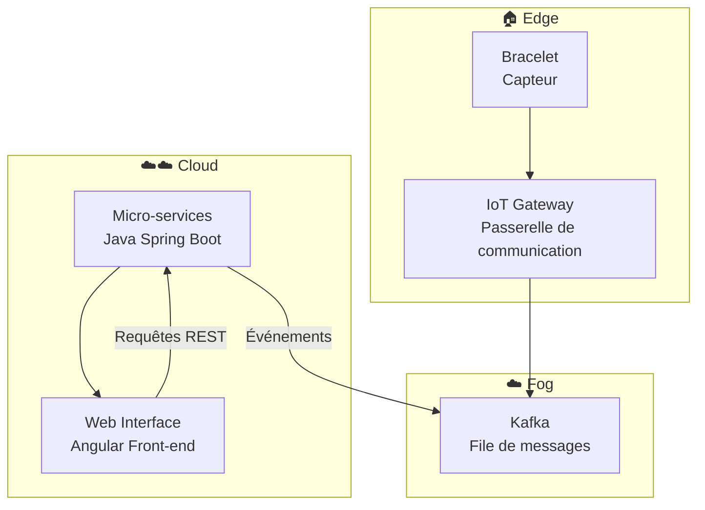
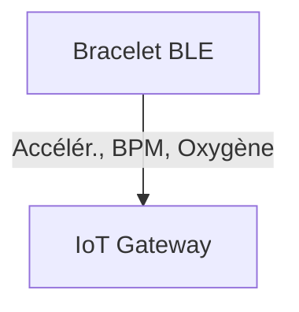
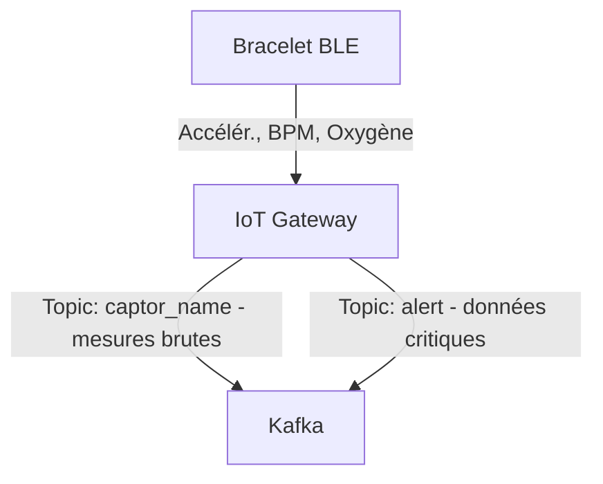

# Architecture

⚠️ Note : Tout ce qui suit ne fait pas nécessairement partie de la version actuelle du dépôt (PoC). Il s’agit d’objectifs et de bonnes pratiques à intégrer dans le futur pour transformer le projet en une solution de qualité production et médicale.

## 1) Vue d’ensemble globale (contexte et composants)

Le projet est organisé en plusieurs sous-projets :

* `web-interface` : interface web front-end (Angular). 

* `micro-services` : services back-end (Java Spring).
  
* `kafka` : composants/connexions liés à Kafka (gestion des topics, producteurs/consommateurs).
  
* `iot_gateway` : passerelle pour le bracelet connecté.
  
* `bracelet` : code embarqué (firmware / prototype matériel) pour collecte de données, communiquant par BLE.

Chaque dossier représente un élément du flow suivant :  


---

## 2) Rôles et responsabilités des composants

###  `web-interface` (Front-end Angular)
- **Rôle principal :** fournir une interface utilisateur claire pour la supervision, la configuration et le suivi des données collectées.  
- **Responsabilités :**
  - Consommer les API REST exposées par les micro-services.
  - Afficher les mesures reçues via un dashboard.
  - Permettre l’authentification.
  - Permettre le paramétrage des bracelets (attribution d'un bracelet à un patient).
  - Completion de formulaire pour un patient
- **Technologies :** Angular 20, TypeScript, HTML, CSS.

---

### `micro-services` (Back-end Java Spring Boot)
- **Rôle principal :** gérer la logique métier, le stockage des données et les interactions entre la queue kafka et l’interface web.  
- **Responsabilités :**
  - Fournir les API REST consommées par le front-end.
  - Traiter les messages issus de Kafka.
  - Gérer la persistance des données dans la base de données.
  - Implémenter les mécanismes d’alerte ou de détection d’anomalies.
  - Exposer des endpoints de monitoring et de santé.
- **Technologies :** Java 25, Spring Boot, JPA/Hibernate, PostgreSQL.

---

### `kafka` (Bus de messages)
- **Rôle principal :** assurer la communication asynchrone entre la passerelle IoT et les micro-services.  
- **Responsabilités :**
  - Gérer la file d’attente des messages (topics) pour la télémétrie et les alertes.
  - Permettre la mise à l’échelle horizontale (plusieurs producteurs/consommateurs).
- **Fonctionnement :**
  - `iot_gateway` agit comme **producteur**.
  - Les `micro-services` agissent comme **consommateurs**.
- **Technologies :** Apache Kafka, Zookeeper

---

### `iot_gateway` (Passerelle IoT)
- **Rôle principal :** faire le lien entre le monde physique (bracelet BLE) et le fog.  
- **Responsabilités :**
  - Établir la communication BLE avec le bracelet.
  - Gérer la connectivité réseau (Wi-Fi, Ethernet, 4G) pour publier vers Kafka.
  - Implémenter la sécurité (authentification des devices, chiffrement des échanges).
  - Servir de point de contrôle pour envoyer des commandes au bracelet.
- **Technologies :** Node.js, Kafka Producer API.

---

### `bracelet` (Firmware / Périphérique BLE)
- **Rôle principal :** collecter les données physiologiques et environnementales, puis les transmettre à la passerelle.  
- **Responsabilités :**
  - Mesurer les données (ex : fréquence cardiaque, oxygène et accéléromètre).
  - Communiquer via **Bluetooth Low Energy (BLE)**.
  - Gérer la consommation d’énergie et la fiabilité de la connexion.
  - Réceptionner éventuellement des commandes venant de la passerelle (mise à jour, calibration).


---

**Résumé du flux global :**
1. Le **bracelet** collecte les données et les envoie à la **IoT Gateway** via BLE.  
2. L' **IOT Gateway** publie ces données dans **Kafka** sous forme de messages.  
3. Les **micro-services** consomment ces messages, les traitent et les stockent.  
4. La **web-interface** récupère les informations et les affiche à l’utilisateur final.

---

## 3) Composants : flux et mécanismes

### 3.1 Bracelet

**Rôle :** capteur BLE embarqué pour collecte de données physiologiques.

**Métriques collectées :**
- **Accéléromètre** : activité (toutes les 1s).  
- **BPM (heartRate)** : fréquence cardiaque (toutes les 5s).  
- **Oxygène (bloodOxygen)** : saturation en oxygène SpO₂ (toutes les 10s).  

**Mécanismes :**

- **Workflow :**
  - Mesure des métriques selon des intervalles configurables :  
    - **Justification :** Accéléromètre exige une fréquence plus élevée pour capturer les mouvements précis, alors que BPM et SpO₂ varient plus lentement, permettant des intervalles plus longs pour réduire le trafic réseau et la consommation d’énergie.  
  - Transmission périodique vers l’IoT Gateway via WebSocket (PoC uniquement) ou BLE.  
    - **Justification :** BLE est efficace pour les communications locales à faible consommation. WebSocket permet un protocole fiable pour tests ou simulation sans matériel BLE.  
  - Messages envoyés individuellement ou en **batch** en cas de perte de connectivité avec kafka.  
  - ACK ou confirmation de réception pour garantir la fiabilité.  
    - **Justification :** Assure que les données critiques physiologiques ne sont pas perdues et permet un suivi précis.  

---

- **Sécurité :**
  - Appairage BLE sécurisé et chiffrement AES-CCM.  
    - **Justification :** Protection contre interception ou injection de données sensibles.  
  - Signature et checksum pour garantir l’intégrité des données.  
    - **Justification :** Vérifie que les données ne sont pas corrompues pendant la transmission.    

---

- **Fiabilité :**
  - Retry automatique pour messages non envoyés ou non accusés.  
    - **Justification :** Permet de gérer les interruptions réseau temporaires et assure la complétude des données.   
  - Possibilité de **batching conditionnel** pour optimiser le trafic réseau.  
    - **Justification :** Limite le nombre de messages envoyés pour les métriques lentes (BPM, SpO₂), économisant énergie et bande passante.  

---

- **Déploiement :**
  - Stockage tampon minimal pour messages non transmis, libéré dès réception confirmée par la Gateway.  
    - **Justification :** Garantit fiabilité tout en limitant l’utilisation mémoire sur le bracelet.  

---

- **Monitoring :**
  - Logs internes limités pour économie de mémoire, exportables via Gateway pour supervision.  
    - **Justification :** Permet de suivre la santé du dispositif et de diagnostiquer les problèmes sans saturer le bracelet.  

---

**Schéma :**


### 3.2 IoT Gateway

**Rôle :** passerelle entre les bracelets publication des données sur Kafka.

**Mécanismes :**

- **Workflow :**
  - Reçoit les données des bracelets via **BLE**.  
  - Conversion et normalisation des mesures en **JSON**.  
  - Publication sur les topics Kafka :  
    - `captor_name` : données brutes issues des capteurs (Accéléromètre, BPM, Oxygène).  
    - `alert` : alertes médicales détectées en local (ex. rythme cardiaque anormal, oxygénation faible, chute).  
  - Envoi d’un **ACK** vers le bracelet après réception et validation des données.  
  - **Justification :** la séparation entre `captor_name` et `alert` permet un routage prioritaire des urgences sans surcharger le flux principal de télémétrie.

---

- **Sécurité :**
  - Connexion BLE sécurisée avec chiffrement **AES-CCM**.  
  - Connexion à Kafka via **SASL_SSL** pour authentification et chiffrement des échanges.  
  - Validation du schéma JSON et contrôle d’intégrité avant envoi.  
  - **Justification :** ces mécanismes garantissent que seules des données fiables et authentifiées sont propagées vers le Cloud.

---

- **Fiabilité :**
  - Buffer local (en RAM ou fichier) pour stocker temporairement les mesures en cas de perte de connectivité Kafka.  
  - Retry exponentiel pour les envois échoués.  
  - Reconnexion BLE automatique.  
  - **Justification :** permet une continuité du flux de données même en cas d’incident réseau ou matériel.

---

- **Déploiement :**
  - Conteneur Docker léger (ARM/x86 compatible).  
  - Configuration via variables d’environnement (Kafka brokers, topics, seuils d’alerte, fréquence de polling).  
  - Healthchecks actifs pour supervision par orchestrateur (Docker Compose).  
  - **Justification :** assure un déploiement homogène sur différentes passerelles physiques tout en simplifiant la maintenance.

---

- **Monitoring :**
  - Export métriques vers Prometheus : taux de messages traités, taux d’erreurs, latence BLE, backlog Kafka.  
  - Logs structurés au format JSON.  
  - Alertes techniques si déconnexion prolongée ou fréquence de publication anormale.  
  - **Justification :** visibilité complète du pipeline IoT et détection proactive des pannes.

---

**Schéma :**


### 3.3 Kafka

**Rôle :** middleware assurant la transmission fiable, asynchrone et distribuée des données entre la couche IoT (Gateway) et les micro-services du Cloud.  

---

**Mécanismes :**

- **Workflow :**
  - Reçoit les publications de la Gateway sur deux topics principaux :  
    - `captor_name` → données brutes (Accéléromètre, BPM, Oxygène).  
    - `alert` → messages prioritaires (alerte médicale, anomalie critique).  
  - Les micro-services consommateurs (`data-processor`, `alert-service`) s’abonnent aux topics correspondants.  
  - Les messages sont traités de manière asynchrone pour éviter tout blocage de flux.  
  - **Justification :** découple complètement la collecte IoT du traitement applicatif, garantissant la tolérance aux pannes et une ingestion fluide à grande échelle.

---

- **Sécurité :**
  - Communication sécurisée via **SASL_SSL** (authentification + chiffrement TLS).  
  - Contrôle d’accès par **ACL** sur les topics : seules les passerelles autorisées peuvent publier, et seuls les micro-services validés peuvent consommer.  
  - **Justification :** prévient les accès non autorisés, la falsification des messages et les erreurs de structure.

---

- **Fiabilité :**
  - Réplication des partitions.  
  - Acknowledgements (`acks=all`) pour garantir la persistance des messages.  
  - Stockage persistant.  
  - **Justification :** aucun message n’est perdu même en cas de panne d’un broker ou d’une instance Gateway.

---

- **Déploiement :**
  - Cluster Kafka orchestré (Docker Compose).  
  - Brokers distribués + Zookeeper.  
  - Configuration de la rétention (ex : 7 jours) et du débit maximal par topic.  
  - **Justification :** permet une montée en charge linéaire et un déploiement multi-environnements (préprod, prod, test).

---

- **Monitoring :**
  - Intégration Prometheus :  
    - latence moyenne de production et consommation,  
    - taille des partitions,  
    - taux d’erreurs réseau,  
    - backlog de messages non consommés.  
  - Alertes automatisées sur consommation lente ou saturation de partition.  
  - **Justification :** garantit la stabilité du pipeline temps réel et la réactivité face aux anomalies.

---

- **Scalabilité :**
  - Partitionnement selon la charge pour paralléliser le traitement des données.  
  - **Justification :** Kafka supporte une croissance continue sans goulot d’étranglement.

---

**Schéma :**
```mermaid
GW[IoT Gateway] -->|Topic: captor_name - mesures brutes| K[Kafka Cluster]
GW -->|Topic: alert - données critiques| K
K -->|Consommation asynchrone| MS[Microservices]
```

## Microservices

**Rôle global :**
Ensemble de services **Spring Boot** indépendants et conteneurisés, exposant des **API REST sécurisées (TLS)** pour :

* La gestion des utilisateurs (`User Service`).
* La collecte et l’analyse des données physiologiques (`Data Processing Service`).
* La gestion et soumission des formulaires (`Form Service`).
* L’agrégation des informations patient (`Patient Management Service`).
* Système d’alerte envoyant emails et notifications web (`Alert Service`).
* Authentification et redirection vers les services (`Gateway`).

---

### **Éléments globaux de l’infrastructure :**

* **Cluster Kubernetes :**

  * Orchestration des conteneurs pour scalabilité et haute disponibilité.
  * Rollouts progressifs et mises à jour sans interruption (zero-downtime deployment).
  * Load balancing interne entre microservices.

* **API Gateway (microservice) :**

  * Point d’entrée unique pour tous les clients.
  * Authentification centralisée via JWT.
  * Routage vers les services appropriés (`User Service`, `Form Service`, etc.).

* **Kafka :**

  * Communication asynchrone pour les alertes et les données critiques.
  * Décorrélation entre producteurs (Gateway / Data Processing) et consommateurs (Alert Service).
  * Support de plusieurs consommateurs pour le scaling horizontal.

* **Bases de données dédiées :**

  * Isolation par service (PostgreSQL standard pour Users et Forms, TimescaleDB pour Data Processing).
  * Sauvegardes et restaurations indépendantes.

* **Monitoring et observabilité :**

  * **Prometheus + Grafana** pour mesurer latence, taux d’erreurs, consommation Kafka.
  * Logs centralisés pour debugging et audit.
  * Liveness & readiness probes pour Kubernetes afin de détecter et redémarrer automatiquement les services en erreur.

* **Sécurité :**

  * TLS pour toutes les communications REST inter-services.
  * Gestion des secrets via Vault / Kubernetes Secrets.
  * Accès base de données restreint par service et rôle.

---

### **Justifications :**

* **Conteneurs + Kubernetes** : scalabilité, résilience, déploiement sûr et rapide.
* **Gateway centralisée** : simplifie l’authentification et le routage, réduit le couplage direct entre services.
* **Kafka** : tolérance aux pannes et découplage des producteurs et consommateurs pour les alertes.
* **Bases dédiées** : isolation des données, flexibilité, performance, et sécurité.
* **Monitoring et observabilité** : indispensable pour détecter les anomalies, respecter les SLA et garantir la sécurité des données patients.

## 🔹 Gateway Microservice

**Rôle :**

* Point d’entrée unique pour toutes les requêtes externes (Web Interface, clients mobiles).
* Authentification centralisée (JWT + TLS) et routage vers les microservices appropriés (`User Service`, `Form Service`).
* Gestion des flux entrants vers le `Data Processing Service` pour publication Kafka si nécessaire.

**Mécanismes :**

* REST sécurisé via TLS pour toutes les communications.
* Routage interne vers les services backend.
* Monitoring latence et taux d’erreurs via Prometheus.
* Scalabilité horizontale via Kubernetes.
* Rate limiting
* Circuit breaker
* Timeouts & retries
* Health checks

**Base de données :**

* Aucun stockage dédié ; tout est relayé vers les microservices backend.

**Justification :**

* Centralisation de l’authentification et du routage pour réduire le couplage et améliorer la sécurité globale.

---

## 🔹 User Service + PostgreSQL

**Rôle :**

* Gestion des utilisateurs : création, modification, suppression, consultation.
* Gestion des permissions et historiques de connexion.

**Mécanismes :**

* REST via Gateway pour toutes les requêtes utilisateurs.
* Stockage dans PostgreSQL relationnel.
* Sauvegarde et réplication pour résilience.

**Justification :**

* Isolation des données sensibles et intégrité relationnelle pour la conformité et sécurité.
* Scalabilité indépendante possible via Kubernetes.

---

## 🔹 Form Service + PostgreSQL + JSONB

**Rôle :**

* Gestion des formulaires flexibles soumis par utilisateurs/patients.
* Support de données semi-structurées pour différents types de formulaires.

**Mécanismes :**

* REST via Gateway.
* Stockage dans PostgreSQL avec **JSONB** pour flexibilité.
* Sauvegarde indépendante pour éviter impact sur d’autres services.

**Justification :**

* Flexibilité maximale des formulaires.
* Isolation et scalabilité indépendantes pour une meilleure performance globale.

---

## 🔹 Data Processing Service + TimescaleDB (DPDB)

**Rôle :**

* Collecte et traitement des métriques physiologiques : BPM, oxygène, accéléromètre.
* Analyse et aggrege.

**Mécanismes :**

* Ingestion asynchrone depuis la Gateway.
* Stockage dans **TimescaleDB** pour séries temporelles.
* Partitionnement automatique par date.
* Indexation pour calculs analytiques rapides.

**Justification :**

* Performance pour les métriques continues.
* Scalabilité et résilience avec Kafka et TimescaleDB.

---

## 🔹 Alert Service + TimescaleDB

**Rôle :**

* Réception des alertes critiques depuis Kafka (`alert`).
* Notification par email et web aux docteurs/soignants.
* Historisation des alertes pour audit et suivi médical.

**Mécanismes :**

* Consommation Kafka avec retry automatique.
* Stockage dans **TimescaleDB** pour séries temporelles d’alertes.
* Partitionnement par date et indexation pour faciliter l’analyse.

**Justification :**

* Historisation obligatoire pour suivi et conformité.
* Découplage du traitement principal pour résilience et performance.

---

## 🔹 Patient Management Service

**Rôle :**

* Agrégation des informations patients depuis `User Service` et `Data Processing Service`.
* Fournit API REST pour consultation par Web Interface ou autres clients.

**Mécanismes :**

* REST sécurisé vers les services sources.
* Cache temporaire possible pour améliorer temps de réponse.
* Monitoring sur performance et disponibilité.

**Base de données :**

* Pas de DB propre ; données agrégées via appels aux services backend.

**Justification :**

* Évite duplication des données sensibles.
* Réduit la complexité et permet scalabilité horizontale.

### **Schéma d’architecture des microservices**


## Web Interface

**Rôle :**

* Interface utilisateur pour consultation et interaction avec les données patients, formulaires et alertes.
* Communique uniquement avec le **Gateway Microservice** pour accéder aux services backend.

**Mécanismes :**

* REST sécurisé via TLS vers la Gateway.
* Authentification via JWT récupéré lors du login.
* Consommation des notifications en temps réel (WebSocket) pour alertes critiques.
* Monitoring de performance (temps de chargement, erreurs JS).
* Scalabilité horizontale possible via hébergement sur un cluster web ou CDN.

**Justification :**

* Séparation claire front/back pour sécurité et maintenabilité.
* Consommation uniquement via Gateway réduit le couplage direct avec les microservices.
* Notifications temps réel permettent une réactivité immédiate en cas d’alerte médicale.

# Schema global

